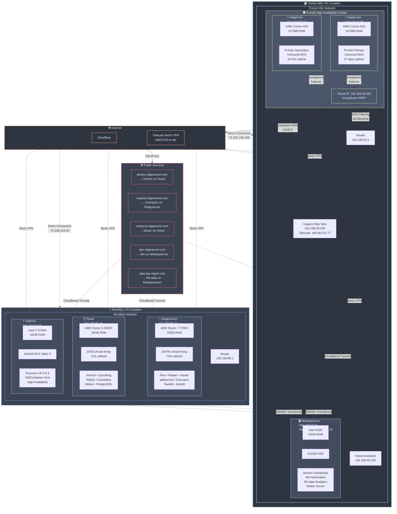
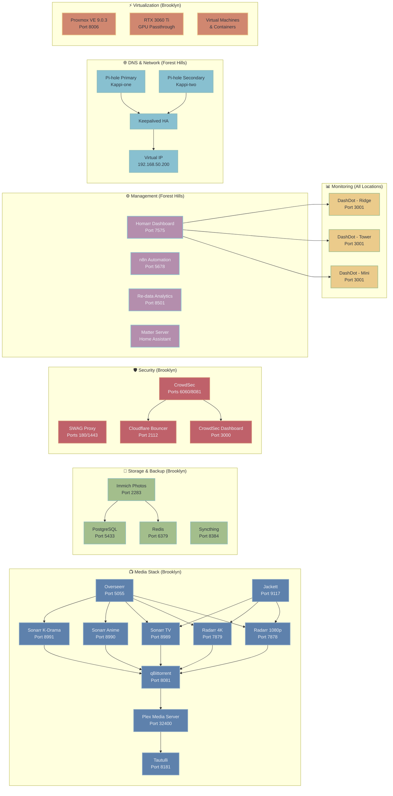

# 🏠 Homelab Infrastructure Documentation

> [!info] Documentation Info
> **Last Updated:** October 20, 2025  
> **Generated From:** System Information Collection + Homarr Configuration Analysis  
> **Documentation Version:** 2.0 - Enhanced with Live System Data  
> **Total Systems:** 6 physical systems across 2 NYC locations

## 📋 Table of Contents

- [[#🌟 Overview|🌟 Overview]]
- [[#🌐 Infrastructure Diagram|🌐 Infrastructure Diagram]]
- [[#🔗 Network Architecture|🔗 Network Architecture]]
- [[#💻 Hardware Infrastructure|💻 Hardware Infrastructure]]
- [[#⚙️ Core Services|⚙️ Core Services]]
- [[#📺 Media Stack|📺 Media Stack]]
- [[#📊 Monitoring & Management|📊 Monitoring & Management]]
- [[#🤖 Development & Automation|🤖 Development & Automation]]
- [[#🌍 External Services|🌍 External Services]]
- [[#🛡️ Security & Networking|🛡️ Security & Networking]]
- [[#📈 System Performance & Metrics|📈 System Performance & Metrics]]
- [[#🔧 Operational Procedures|🔧 Operational Procedures]]
- [[#🚨 Troubleshooting Guide|🚨 Troubleshooting Guide]]

---

## 🌟 Overview

> [!abstract] Infrastructure Summary
> This homelab is a comprehensive self-hosted infrastructure built around multiple specialized servers, each optimized for specific workloads. The setup emphasizes media management, automation, home monitoring, and secure remote access through Tailscale VPN mesh networking.

### 🏗️ Infrastructure Philosophy

> [!note] Design Principles
> - 🌍 **Geographic Distribution:** Multi-location deployment across NYC area
> - ⚡ **High Availability:** Multiple servers with 27-92 day uptimes
> - 🎯 **Specialized Workloads:** Each server optimized for specific tasks
> - 🛡️ **Security-First:** Tailscale mesh VPN, Pi-hole DNS filtering, container isolation
> - 🤖 **Automation-Focused:** n8n workflows, automated media management
> - 🏠 **Self-Hosted:** Minimal reliance on external cloud services

### 📍 Geographic Distribution

> [!example]- Brooklyn, NY Location 🏢
> - 💾 **Primary Media Server:** Ridgeserver (`100.107.45.13`)
> - 🗄️ **Secondary Storage:** Tower (`100.78.240.7`)  
> - ⚡ **Virtualization Platform:** Kapmox (`100.99.51.49`)

> [!example]- Forest Hills, NY Location 🏠
> - 🖥️ **Management & Automation Hub:** Minikapserver (`100.121.136.23`)
> - 🛡️ **Network Security:** Kappi-one & Kappi-two (Pi-hole HA cluster)
> - 📱 **Additional Devices:** Kappy's Mac Mini, iPhone, Kaptop, etc.

### 🔑 Key Infrastructure Components

| Component | Location | Purpose | Tailscale IP |
|-----------|----------|---------|--------------|
| 💾 **Ridgeserver** | Brooklyn, NY | Primary Media Server | `100.107.45.13` |
| 🖥️ **Minikapserver** | Forest Hills, NY | Management & Automation Hub | `100.121.136.23` |
| 🛡️ **Pi-hole Cluster** | Forest Hills, NY | Network Security & DNS | N/A (Local only) |
| 🗄️ **Tower** | Brooklyn, NY | Secondary Storage & Services | `100.78.240.7` |
| ⚡ **Kapmox** | Brooklyn, NY | Virtualization Platform | `100.99.51.49` |
| 🌐 **Tailscale Mesh** | Both Locations | Remote Access Network | `tailef17b3.ts.net` |
| 📊 **Homarr Dashboard** | Forest Hills, NY | Central Management | `minikapserver:7575` |

### 📊 Current System Status

> [!success] Infrastructure Health
> - 🖥️ **Total Systems:** 6 physical systems across 2 locations
> - ⏱️ **Total Uptime:** 23 minutes to 92 days (Tower: 92 days champion! 🏆)
> - 📦 **Active Containers:** 42 total (15 on Ridgeserver, 12 on Tower, 6 on Minikapserver)
> - 🌐 **Network Devices:** 9 Tailscale-connected devices
> - 💾 **Storage Utilization:** 190TB total capacity, 124TB used (65% overall)
> - ⚙️ **Service Count:** 25+ self-hosted services across the infrastructure

> [!tip] Key Features
> - 🛡️ **Pi-hole HA:** Working dual Pi-hole setup with Keepalived failover ✅
> - ⚡ **Virtualization:** Proxmox 9.0.3 with 64GB RAM and RTX 3060 Ti
> - 🔄 **Cross-Location Sync:** 583GB+ data transferred between locations

### Service Distribution by Function

#### Media Management & Streaming (Ridgeserver)
- **Plex Media Server** - Primary streaming platform
- **Radarr** (2 instances) - Movie acquisition (1080p + 4K)
- **Sonarr** (3 instances) - TV show acquisition (General, Anime, K-Drama)
- **qBittorrent** - Download client
- **Overseerr** - User request interface
- **Tautulli** - Plex analytics and monitoring
- **Jackett** - Indexer aggregation
- **Requestrr** (3 instances) - Discord bot integration

#### Photo & File Management (Tower)
- **Immich** - Self-hosted photo management (Google Photos alternative)
- **Syncthing** - File synchronization across devices
- **PostgreSQL** - Database backend for Immich
- **Redis** - Caching layer

#### Security & Access (Tower)
- **SWAG** - Reverse proxy with SSL termination
- **CrowdSec** - Intrusion detection and prevention
- **CrowdSec Dashboard** - Security analytics
- **Cloudflare Bouncer** - DDoS protection
- **Wizarr** - User onboarding for Plex

#### Automation & Management (Minikapserver)
- **Homarr** - Central dashboard and service management
- **n8n** - Workflow automation platform
- **Re-data** - Data analytics and monitoring
- **Matter Server** - Home Assistant integration
- **Nebula Sync** - File synchronization

#### Infrastructure Services (All Systems)
- **DashDot** (3 instances) - System monitoring
- **Pi-hole** (Kappi-one) - Ad blocking for Forest Hills location only
- **Tailscale** - Mesh VPN across all systems
- **Cloudflared** - Secure tunneling

---

## 🌐 Infrastructure Diagram

> [!info] Network Topology
> This diagram shows the complete infrastructure layout across both NYC locations, including hardware specifications, network connections, and service distribution.



## 🔗 Network Architecture

> [!warning] Multi-Location Setup
> This homelab spans **two physical locations** in New York, connected via Tailscale mesh VPN, creating a unified infrastructure across geographic boundaries.

### 🌐 Multi-Location Mesh Network

> [!example]- 🏢 Brooklyn, NY Location (`192.168.86.x` subnet)
> | Device | Local IP | Tailscale IP | Status |
> |--------|----------|--------------|---------|
> | 💾 **Ridgeserver** | `192.168.86.44` | `100.107.45.13` | 🟢 Active |
> | 🗄️ **Tower** | `192.168.86.46` | `100.78.240.7` | 🟢 Active (92d) |
> | ⚡ **Kapmox** | `192.168.86.88` | `100.99.51.49` | 🟢 Active |
> | 🌐 **Internet** | Direct connection via `74.108.219.34` | | |

> [!example]- 🏠 Forest Hills, NY Location (`192.168.50.x` subnet)
> | Device | Local IP | Tailscale IP | Status |
> |--------|----------|--------------|---------|
> | 🖥️ **Minikapserver** | `192.168.50.31` | `100.121.136.23` | 🟢 Active |
> | 🛡️ **Kappi-one** | `192.168.50.88` | N/A | 🟢 Active (27d) |
> | 🛡️ **Kappi-two** | `192.168.50.151` | N/A | 🟢 Active (23m) |
> | 🏠 **Home Assistant** | `192.168.50.220:8123` | N/A | 🟢 Active |
> | 💻 **Mac Mini** | `192.168.50.209` | `100.98.212.77` | 🟢 Active |
> | 🛡️ **Pi-hole VIP** | `192.168.50.200` | N/A | 🟢 HA Cluster |

### 🔒 Tailscale VPN Mesh Network

> [!info] Mesh Network Details
> - 🌐 **Domain:** `tailef17b3.ts.net`
> - 🎯 **Purpose:** Secure inter-location connectivity and remote access
> - 🕸️ **Network Type:** Mesh VPN with direct connections where possible
> - 📱 **Connected Devices:** 9 total devices across both locations

> [!success] Active Connections & Data Transfer
> | Connection | Type | Data Transferred | Status |
> |------------|------|------------------|---------|
> | 💾 **Ridgeserver** ↔ 🖥️ **Minikapserver** | Direct | 583GB+ | 🟢 Active |
> | 🗄️ **Tower** ↔ 🖥️ **Minikapserver** | Direct | 300GB+ | 🟢 Active |
> | ⚡ **Kapmox** ↔ 💻 **Mac Mini** | Direct | 135GB+ | 🟢 Active |
> 
> **Cross-location latency:** Optimized via Tailscale's direct connections

### 🌐 DNS Architecture

> [!success]- 🏠 Forest Hills, NY Location (Protected)
> - 🛡️ **Primary DNS:** Pi-hole (`192.168.50.200`) - HA Virtual IP
> - ☁️ **Upstream DNS:** `8.8.8.8` (Google) from Pi-hole
> - 📡 **Coverage:** Local network only (`192.168.50.x` subnet)
> - ⚙️ **Services:** Network-wide ad blocking, custom DNS records
> - 🔄 **High Availability:** Keepalived failover between Kappi-one & Kappi-two

> [!warning]- 🏢 Brooklyn, NY Location (Unprotected)
> - 🌐 **Primary DNS:** Router default (likely ISP DNS)
> - ❌ **No Pi-hole:** Brooklyn systems use standard DNS resolution
> - 🔒 **Tailscale DNS:** `100.100.100.100` for mesh network resolution

> [!info]- 🔗 Cross-Location DNS
> - 🕸️ **Tailscale Mesh:** Uses Tailscale's DNS (`100.100.100.100`) for inter-location resolution
> - 🔍 **Service Discovery:** Tailscale handles `.ts.net` domain resolution across locations
> - 📍 **Local Resolution:** Each location maintains its own subnet resolution

### Public-Facing Services
- **Domain:** ridgeserver.com
- **SSL/TLS:** Custom trusted certificates + Cloudflare integration
- **Reverse Proxy:** SWAG on Tower (Brooklyn) + Cloudflared tunnels
- **Services:**
  - photos.ridgeserver.com (Immich on Tower)
  - request.ridgeserver.com (Overseerr on Ridgeserver)
  - onboard.ridgeserver.com (Wizarrr on Tower)
  - n8n.ridgeserver.com (n8n on Minikapserver)
  - data.kap-mgmt.com (Re-data on Minikapserver)

### Service Architecture Overview



### Network Security & Monitoring
- **CrowdSec:** Intrusion detection on Tower (Brooklyn)
- **Cloudflare Bouncer:** DDoS protection integrated with CrowdSec
- **Pi-hole:** Ad blocking for Forest Hills location only (192.168.50.x)
- **Tailscale ACLs:** Access control between locations and devices
- **Firewall:** iptables rules on each system + Docker network isolation

### Pi-hole High Availability Setup (WORKING!) ✅

**Successful Design:** Dual Pi-hole setup with Keepalived for HA
- **Kappi-one:** 192.168.50.88 (primary) + 192.168.50.200 (virtual IP)
- **Kappi-two:** 192.168.50.151 (secondary) + 192.168.50.200 (virtual IP)

**Current Status:**
- **Virtual IP:** 192.168.50.200 shared between both Pi-holes
- **Primary:** Kappi-one (27 days uptime) - stable primary
- **Secondary:** Kappi-two (23 minutes uptime) - recently rebooted
- **Failover:** Keepalived manages automatic failover
- **Coverage:** Forest Hills location only (192.168.50.x subnet)
- **Brooklyn:** No Pi-hole coverage (uses standard DNS)

**High Availability Features:**
- **Keepalived:** VRRP protocol for IP failover
- **Shared Configuration:** Both Pi-holes serve identical blocklists
- **Automatic Failover:** If primary fails, secondary takes over 192.168.50.200
- **Health Monitoring:** Keepalived monitors Pi-hole service health

---

## 💻 Hardware Infrastructure

> [!abstract] Hardware Overview
> Complete specifications for all 6 physical systems across both NYC locations, including CPU, RAM, storage, and service details.

### 🏢 Brooklyn, NY Location

#### 💾 Ridgeserver (Primary Media Server)

> [!info] System Info
> **Location:** Brooklyn, NY  
> **Access:** https://ridgeserver.tailef17b3.ts.net/Dashboard  
> **Tailscale IP:** `100.107.45.13`  
> **Local IP:** `192.168.86.44`  
> **Status:** 🟢 Active (28 days uptime)

**Hardware Specifications:**

> [!example]- 🖥️ CPU: AMD Ryzen 7 7700X 8-Core Processor
> - **Architecture:** x86_64, 16 threads (8 cores, 2 threads/core)
> - **Clock Speed:** 400MHz base, 5.573GHz max boost
> - **Cache:** L1d: 256KB, L1i: 256KB, L2: 8MB, L3: 32MB
> - **Features:** AMD-V virtualization, AVX512, AES-NI

> [!example]- 🧠 RAM: 32GB DDR4
> - **Total:** 30Gi available to system
> - **Used:** 9.6Gi (30% utilization)
> - **Available:** 20Gi free

> [!example]- 💾 Storage: Massive Unraid Array - **164TB Total**
> **Overview:** 121TB used, 43TB free (74% utilization)
> 
> | Component | Capacity | Used | Free | Utilization |
> |-----------|----------|------|------|-------------|
> | 🚀 **Cache Pool** | 2.3TB NVMe | 250GB | 1.6TB | 11% |
> | 💿 **Array Disks** | 164TB (14 disks) | 121TB | 43TB | 74% |
> | 🔧 **Boot Drive** | 32GB USB | - | - | - |
> 
> **Filesystem Mix:** Btrfs and XFS across drives
> **Disk Range:** 1TB to 16TB drives

> [!example]- 🌐 Network & OS
> - **Network:** Bonded Ethernet + Tailscale mesh
> - **OS:** Unraid OS 7.1.4 (Slackware-based)
> - **Kernel:** 6.12.24-Unraid

**Storage Array Details:**

> [!danger] Critical Storage Alerts
> | Disk | Capacity | Used | Free | Status |
> |------|----------|------|------|---------|
> | 💿 **Disk 1** | 17TB | 16TB | 960GB | 🔴 95% full |
> | 💿 **Disk 2** | 15TB | 15TB | 255GB | 🔴 99% full |
> 
> > [!warning] Action Required
> > These disks are critically full and need immediate attention!

> [!success] Recent Expansion
> | Disk | Capacity | Used | Free | Status |
> |------|----------|------|------|---------|
> | 💿 **Disk 13** | 13TB | 1.5TB | 12TB | 🟢 12% full |
> | 💿 **Disk 14** | 13TB | 1.5TB | 12TB | 🟢 12% full |
> 
> > [!tip] Newest Drives
> > Recently added drives with plenty of capacity

**Services Hosted:**

> [!note]- 📺 Media Services
> | Service | Port | Purpose | Status |
> |---------|------|---------|---------|
> | 🎬 **Plex Media Server** | 32400 | Primary streaming service | 🟢 Active |
> | 🎭 **Radarr 1080p** | 7878 | Movie management | 🟢 Active |
> | 🎭 **Radarr 4K** | 7879 | 4K movie management | 🟢 Active |
> | 📺 **Sonarr TV** | 8989 | TV show management | 🟢 Active |
> | 🎌 **Sonarr Anime** | 8990 | Anime management | 🟢 Active |
> | 🇰🇷 **Sonarr K-Drama** | 8991 | K-Drama management | 🟢 Active |
> | ⬇️ **qBittorrent** | 8081 | Download client | 🟢 Active |
> | 📋 **Overseerr** | 5055 | Media request management | 🟢 Active |

> [!note]- 🔧 Support Services
> | Service | Port | Purpose | Status |
> |---------|------|---------|---------|
> | 📊 **Tautulli** | 8181 | Plex analytics | 🟢 Active |
> | 🔍 **Jackett** | 9117 | Indexer proxy | 🟢 Active |
> | 🤖 **Requestrr** | 4545-4547 | Discord bot (3 instances) | 🟢 Active |
> | 📈 **DashDot** | 3001 | System monitoring | 🟢 Active |
> | ☁️ **Cloudflared** | - | Secure external access | 🟢 Active |

> [!info]- 🐳 Docker Configuration
> - **Version:** Docker 27.5.1 with Compose v2.35.1
> - **Storage Driver:** Btrfs on 100GB allocated space
> - **Active Containers:** 15 running, 0 stopped
> - **Container Uptime:** 3-6 days (recently restarted)

#### Kapmox (Proxmox Virtualization Host)
**Location:** Brooklyn, NY  
**Access:** https://kapmox:8006  
**Tailscale IP:** 100.99.51.49  
**Local IP:** 192.168.86.88  
**Status:** Active (3 days uptime)

**Hardware Specifications:**
- **CPU:** Intel Core i7-9700K @ 3.6GHz
  - Architecture: x86_64, 8 cores (no hyperthreading)
  - Base Clock: 800MHz, Max Boost: 4.9GHz
  - Cache: L1d: 256KB, L1i: 256KB, L2: 2MB, L3: 12MB
  - Features: VT-x virtualization, AES-NI, AVX2
- **RAM:** 64GB (62Gi total, 2.3Gi used, 60Gi available)
- **GPU:** NVIDIA GeForce RTX 3060 Ti Lite Hash Rate
- **Storage:** Multiple NVMe drives with LVM configuration
  - **Boot:** NVMe drive with EFI partition
  - **System:** LVM with pve-root (94GB, 4% used)
  - **Data:** LVM thin pools for VM storage
- **Network:** Realtek RTL8111 Gigabit Ethernet + Tailscale
- **OS:** Proxmox VE 9.0.3 (Debian 13 "Trixie" based)
- **Kernel:** 6.14.8-2-pve

**Proxmox Configuration:**
- **Version:** 9.0.3 (latest stable)
- **Services:** pveproxy, pvedaemon, pve-firewall, pvestatd
- **High Availability:** pve-ha-lrm, pve-ha-crm services running
- **Storage:** LVM-thin pools for VM/container storage
- **Networking:** Bridge (vmbr0) for VM networking

**Purpose:**
- Primary virtualization platform for the Brooklyn location
- VM and LXC container hosting
- GPU passthrough capabilities (RTX 3060 Ti)
- High availability cluster member
- Infrastructure backbone for additional services

---

### Forest Hills, NY Location

#### Minikapserver (Management & Automation Hub)
**Location:** Forest Hills, NY  
**Access:** SSH + Web Services  
**Tailscale IP:** 100.121.136.23  
**Local IP:** 192.168.50.31  
**Status:** Active (40 days uptime)

**Hardware Specifications:**
- **CPU:** Intel N100 (4 cores, 700MHz-3.4GHz)
  - Architecture: x86_64
  - Cache: L1d: 128KB, L1i: 256KB, L2: 2MB, L3: 6MB
  - Features: VT-x virtualization, AES-NI, AVX2
- **RAM:** 16GB (15Gi total, 2.3Gi used, 13Gi available)
- **Storage:** 512GB FORESEE SSD
  - LVM Configuration: ubuntu-vg (473.89GB total, 373.89GB free)
  - Root: 100GB allocated (15GB used, 79GB free)
  - Boot: 2GB partition
- **Network:** Realtek RTL8111 Gigabit Ethernet
- **OS:** Ubuntu 24.04.3 LTS (Noble Numbat)
- **Kernel:** 6.8.0-79-generic

**Services Hosted:**
- **Homarr Dashboard** (Port 7575) - Central management interface
- **DashDot** (Port 3001) - System monitoring
- **n8n** (Port 5678) - Workflow automation
- **Re-data** (Port 8501) - Data analytics platform
- **Matter Server** - Home Assistant integration
- **Nebula Sync** - File synchronization
- **Cloudflared** - Tunnel service

**Docker Configuration:**
- **Version:** Docker 28.4.0 with Compose v2.39.2
- **Storage Driver:** overlay2 on ext4
- **Active Containers:** 6 running, 0 stopped
- **Networks:** 6 custom bridge networks
- **Compose Files:** 6 active projects

#### Kappi-one (Primary Pi-hole Server)
**Location:** Forest Hills, NY  
**Primary IP:** 192.168.50.88  
**Pi-hole IP:** 192.168.50.200 (shared virtual IP)  
**Status:** Active (27 days uptime)

**Hardware Specifications:**
- **CPU:** ARM Cortex-A53 (4 cores, 600MHz-1.4GHz)
  - Architecture: ARMv7l (32-bit)
  - BogoMIPS: 44.80
  - Features: NEON, VFPv4, Hardware crypto
- **RAM:** 917MB total (213MB used, 672MB available)
- **Storage:** 128GB Samsung Flash Drive FIT (USB 3.0)
  - Root: 118GB (3.9GB used, 109GB available)
  - Boot: 505MB (125MB used)
- **Network:** Built-in Ethernet + Wi-Fi (disabled)
- **OS:** Ubuntu 22.04.5 LTS (Jammy Jellyfish)
- **Kernel:** 5.15.0-1085-raspi

**Services Hosted:**
- **Pi-hole FTL** - DNS filtering and ad blocking
- **Unbound** - Recursive DNS resolver
- **Docker** - Container runtime (27.5.1)
- **SSH Server** - Remote access
- **Avahi** - mDNS/DNS-SD service discovery

**Network Configuration:**
- **Primary Interface:** eth0 (192.168.50.88/24)
- **Secondary IP:** 192.168.50.200/24 (Pi-hole virtual IP)
- **Gateway:** 192.168.50.1
- **DNS:** 8.8.8.8 (upstream)
- **DHCP:** Likely serving network DHCP

#### Kappi-two (Secondary Pi-hole Server) - **FOUND!** 🎉
**Location:** Forest Hills, NY  
**Primary IP:** 192.168.50.151  
**Pi-hole IP:** 192.168.50.200 (shared virtual IP)  
**Status:** Active (23 minutes uptime - recently rebooted)

**Hardware Specifications:**
- **CPU:** ARM Cortex-A53 (4 cores, 600MHz-1.4GHz)
  - Architecture: ARMv7l (32-bit)
  - BogoMIPS: 51.20
  - Features: NEON, VFPv4, Hardware crypto
- **RAM:** 917MB total (112MB used, 784MB available)
- **Storage:** 128GB Samsung Flash Drive FIT (USB 3.0)
  - Root: 118GB (3.5GB used, 109GB available)
  - Boot: 505MB (125MB used)
- **Network:** Built-in Ethernet (different MAC than kappi-one)
- **OS:** Ubuntu 22.04.5 LTS (Jammy Jellyfish)
- **Kernel:** 5.15.0-1085-raspi

**Services Hosted:**
- **Pi-hole FTL** - DNS filtering and ad blocking (secondary)
- **Unbound** - Recursive DNS resolver
- **Keepalived** - High availability management
- **SSH Server** - Remote access
- **Avahi** - mDNS/DNS-SD service discovery

**Network Configuration:**
- **Primary Interface:** eth0 (192.168.50.151/24)
- **Secondary IP:** 192.168.50.200/24 (Pi-hole virtual IP)
- **Gateway:** 192.168.50.1
- **DNS:** 8.8.8.8 (upstream)
- **HA Status:** Active member of Pi-hole HA cluster

#### 🗄️ Tower (Secondary Storage & Services)

> [!success] System Info - Stability Champion! 🏆
> **Location:** Brooklyn, NY  
> **Access:** https://tower.tailef17b3.ts.net/login  
> **Tailscale IP:** `100.78.240.7`  
> **Local IP:** `192.168.86.46`  
> **Status:** 🟢 Active (92 days uptime - Most stable system!)

**Hardware Specifications:**
- **CPU:** AMD Ryzen 5 2600X Six-Core Processor
  - Architecture: x86_64, 12 threads (6 cores, 2 threads/core)
  - Base Clock: 2.2GHz, Max Boost: 3.6GHz
  - Cache: L1d: 192KB, L1i: 384KB, L2: 3MB, L3: 16MB
  - Features: AMD-V virtualization, AES-NI
- **RAM:** 32GB (31Gi total, 4.7Gi used, 25Gi available)
- **Storage:** Unraid Array - **26TB Total (2.9TB used, 23TB free)**
  - **Cache Pool:** 3TB NVMe (4.7GB used, 3TB free)
  - **Array Disks:** 2 disks (13TB each)
    - Disk 1: 13TB (2.5TB used, 11TB free) - 20% full
    - Disk 2: 13TB (436GB used, 13TB free) - 4% full
  - **Boot:** 30GB SanDisk Cruzer Fit
- **Network:** Bonded Ethernet + Tailscale mesh
- **OS:** Slackware 15.0 (Unraid-based)
- **Kernel:** 6.1.64-Unraid

**Services Hosted:**
- **Immich** (Port 2283) - Photo management and backup
- **Immich PostgreSQL** (Port 5433) - Database for Immich
- **Redis** (Port 6379) - Caching for Immich
- **Wizarr** (Port 5690) - User onboarding for Plex
- **Syncthing** (Port 8384) - File synchronization
- **SWAG** (Ports 180/1443) - Reverse proxy with SSL
- **CrowdSec** (Ports 6060/8081) - Security monitoring
- **CrowdSec Dashboard** (Port 3000) - Security analytics
- **CrowdSec Cloudflare Bouncer** (Port 2112) - DDoS protection
- **Studio Server** (Ports 5432/8543/50059) - Development environment
- **Cloudflare DDNS** - Dynamic DNS updates
- **DashDot** (Port 3001) - System monitoring

**Docker Configuration:**
- **Version:** Docker 20.10.24 with Compose v2.35.1
- **Storage Driver:** Btrfs on 100GB allocated space
- **Active Containers:** 12 running, 1 stopped
- **Container Uptime:** 3 weeks to 3 months (very stable)


---

## Core Services

### Homarr Dashboard
- **Container:** ghcr.io/homarr-labs/homarr:latest
- **Port:** 7575
- **Data:** Persistent storage in ./appdata
- **Features:**
  - Docker integration (mounted socket)
  - Encrypted configuration
  - Custom SSL trust for Pi-hole
  - Three configured dashboards: Dashboard, Kaptop, Kaphone

**Docker Compose Configuration:**
```yaml
services:
  homarr:
    container_name: homarr
    image: ghcr.io/homarr-labs/homarr:latest
    restart: unless-stopped
    volumes:
      - /var/run/docker.sock:/var/run/docker.sock
      - ./appdata:/appdata
    environment:
      - SECRET_ENCRYPTION_KEY=ca2a9e195ca8487f8c1d9f0ca3fee5c989132a2ee7d376051403f321319dbb06
      - NODE_EXTRA_CA_CERTS=/appdata/trusted-certificates/pihole.pem
    ports:
      - '7575:7575'
```

### Home Assistant
**Access:** http://192.168.50.220:8123/lovelace/0

**Purpose:**
- Home automation hub
- Device integration
- Automation orchestration

### Syncthing
**Access:** http://localhost:8384/

**Purpose:**
- File synchronization across devices
- Continuous backup
- Multi-device data sync

---

## Media Stack

### Plex Media Server
**Access:** http://ridgeserver.tailef17b3.ts.net:32400

**Purpose:**
- Central media streaming server
- Library management
- Multi-device streaming

**Integration:** Connected to Homarr for status monitoring

### Radarr (Movie Management)

#### Radarr 1080p
- **URL:** http://ridgeserver.tailef17b3.ts.net:7878/
- **Purpose:** 1080p movie acquisition and management

#### Radarr 4K
- **URL:** http://ridgeserver.tailef17b3.ts.net:7879/
- **Purpose:** 4K/UHD movie acquisition and management

**Integration:** Both instances connected to Homarr dashboard

### Sonarr (TV Show Management)

#### Sonarr TV (General)
- **URL:** http://ridgeserver.tailef17b3.ts.net:8989/
- **Purpose:** TV show acquisition and management

#### Sonarr Anime
- **URL:** http://ridgeserver.tailef17b3.ts.net:8990/
- **Purpose:** Anime-specific show management

#### Sonarr K-Drama
- **URL:** http://ridgeserver.tailef17b3.ts.net:8991/
- **Purpose:** Korean drama acquisition and management

**Integration:** All three instances connected to Homarr dashboard

### qBittorrent
**Access:** http://ridgeserver.tailef17b3.ts.net:8081/

**Purpose:**
- Torrent download client
- Backend for Radarr/Sonarr
- Download management

**Integration:** Connected to Homarr for monitoring

### Overseerr
**Access:** https://request.ridgeserver.com/

**Purpose:**
- Media request management
- User-facing request portal
- Plex/Radarr/Sonarr integration

**Integration:** Connected to Homarr with API integration

### Immich
**Access:** https://photos.ridgeserver.com/

**Purpose:**
- Self-hosted photo and video management
- Google Photos alternative
- Mobile app support

### Wizarrr
**Access:** https://onboard.ridgeserver.com/admin

**Purpose:**
- User onboarding for Plex
- Automated invitation system
- User management

---

## Monitoring & Management

### DashDot (System Monitoring)

**Instances:**
- **Ridgeserver:** http://ridgeserver.tailef17b3.ts.net:3001/
- **Tower:** http://tower.tailef17b3.ts.net:3001/
- **Minikapserver:** http://minikapserver.tailef17b3.ts.net:3001

**Purpose:**
- Real-time system metrics
- CPU, RAM, disk usage
- Network statistics

**Integration:** All three instances connected to Homarr

### Pi-hole
**Access:** https://192.168.50.200/admin/
**Alias:** https://pi.hole

**Features:**
- Network-wide ad blocking
- DNS query monitoring
- Custom DNS records
- DHCP server (likely)
- Custom CA certificates

**Integration:**
- Homarr trusts Pi-hole's custom certificate
- Integrated into dashboard for monitoring

---

## Development & Automation

### n8n Workflow Automation
**Access:** https://n8n.ridgeserver.com/

**Purpose:**
- Workflow automation platform
- API integrations
- Task scheduling
- Data processing

### Re-data
**Access:** https://data.kap-mgmt.com/

**Purpose:**
- Data management/analytics
- Business intelligence
- Property management data (based on NYC-specific apps)

---

## External Services

### Cloud Storage & Productivity

#### Google Workspace
- **Gmail:** https://mail.google.com/mail/u/0/#inbox
- **Google Drive:** https://drive.google.com/

#### Proton Mail
**Access:** https://mail.proton.me/u/2/inbox
**Purpose:** Privacy-focused email (secondary account)

### AI & Development Tools

#### ChatGPT
**Access:** https://chatgpt.com/

#### Gemini
**Access:** https://gemini.google.com/app

### NYC Property Management Services

These services suggest property management or real estate business operations:

#### BIS (Building Information System)
**Access:** https://a810-bisweb.nyc.gov/bisweb/bispi00.jsp
**Purpose:** NYC building permits and inspections

#### DOB Inspections
**Access:** https://a810-lmpaca.nyc.gov/CitizenAccessBuildings/
**Purpose:** Department of Buildings inspection records

#### HPD Online
**Access:** https://a806-pros.nyc.gov/PROS/
**Purpose:** NYC Housing Preservation & Development

#### PIP (Property Information Portal)
**Access:** https://propertyinformationportal.nyc.gov/
**Purpose:** NYC property information and records

#### NYS Rent Regulation
**Access:** https://apps.hcr.ny.gov/SingleSignon/?ReturnUrl=%2fORAOwnerForms%2fDefault.aspx
**Purpose:** NY State rent-regulated property management

#### RPIE Statement
**Access:** https://a836-pts-efile.nyc.gov/SmartFile/Filing/FilingType/Info/NYC_RPIE_2_DEV8
**Purpose:** Real Property Income & Expense filing

---

## Security & Networking

### VPN & Remote Access

#### Tailscale
- **Network:** tailef17b3.ts.net
- **Purpose:** Secure mesh VPN
- **Connected Devices:** All primary servers
- **Benefits:**
  - Zero-trust networking
  - Encrypted connections
  - Easy remote access
  - No port forwarding required

### SSL/TLS Certificates

#### Pi-hole Custom CA
- **Certificate:** pihole.pem (stored in Homarr appdata)
- **Purpose:** Trust self-signed certificates from Pi-hole
- **Configured in:** Homarr environment variables

**Certificate Details:**
- Issuer: Pi-hole (pi.hole)
- Country: DE (Germany)
- Valid until: 2055-09-17

### Network Security

- **DNS Filtering:** Pi-hole ad blocking
- **Encrypted Services:** HTTPS for public-facing services
- **VPN Only Access:** Most services accessible via Tailscale
- **Container Isolation:** Docker-based service isolation

---

## Dashboard Configuration

### Homarr Dashboards

Three configured dashboards for different access points:

1. **Dashboard** (ID: p3epxycnosl5n52eh9oe3mjh)
   - Primary admin dashboard
   - Full service access

2. **Kaptop** (ID: a7b6agktqa0sx7s0h4uw12ex)
   - Laptop-optimized interface
   - Portable device access

3. **Kaphone** (ID: d8zzupzrfgbnp65k48el9epa)
   - Mobile-optimized interface
   - Phone/tablet access

### Dashboard Features

- **Docker Integration:** Live container status
- **Service Monitoring:** Real-time health checks
- **Custom Sections:** Dynamic and empty section types
- **Responsive Layouts:** Device-specific configurations
- **Custom Styling:**
  - Primary color: #fa5252 (red)
  - Secondary color: #fd7e14 (orange)
  - Custom CSS support
  - Configurable opacity and backgrounds

---

## Integration Details

### Connected Services (via Homarr)

#### Media Management
- **Plex:** http://ridgeserver.tailef17b3.ts.net:32400
- **Overseerr:** https://request.ridgeserver.com/
- **Radarr (2 instances):** Ports 7878, 7879
- **Sonarr (3 instances):** Ports 8989, 8990, 8991
- **qBittorrent:** Port 8081

#### System Monitoring
- **DashDot:** 3 instances (Ridgeserver, Tower, Minikapserver)
- **Pi-hole:** https://pi.hole

#### Development Platforms
- **GitHub:** https://api.github.com
  - Container Registry integration
  - Source code management
- **GitHub Container Registry:** ghcr.io
- **Docker Hub:** https://hub.docker.com
- **NPM Registry:** https://registry.npmjs.org

#### Alternative Registries
- **Codeberg:** https://codeberg.org
- **GitLab:** https://gitlab.com
- **Linux Server IO:** https://api.linuxserver.io
- **Quay:** https://quay.io

#### Calendar Integration
- **iCloud CalDAV:** https://p168-caldav.icloud.com

---

## Data Storage & Backup

### Homarr Data Structure

```
appdata/
├── db/
│   └── db.sqlite (5.2 MB)
│       - All dashboard configurations
│       - User permissions
│       - App integrations
│       - Board layouts
├── redis/
│   └── dump.rdb (155 KB)
│       - Session data
│       - Cache
└── trusted-certificates/
    └── pihole.pem (1.5 KB)
        - Pi-hole CA certificate
```

### Backup Strategy

- **Homarr:** Manual backup created (demonstrated by this documentation)
- **Syncthing:** Continuous file synchronization
- **Docker Volumes:** Persistent storage for all services

---

## Service URLs Quick Reference

### Internal Services (Tailscale/Local)

| Service | URL | Port |
|---------|-----|------|
| Homarr | minikapserver:7575 | 7575 |
| Plex | ridgeserver.tailef17b3.ts.net | 32400 |
| Radarr 1080p | ridgeserver.tailef17b3.ts.net | 7878 |
| Radarr 4K | ridgeserver.tailef17b3.ts.net | 7879 |
| Sonarr TV | ridgeserver.tailef17b3.ts.net | 8989 |
| Sonarr Anime | ridgeserver.tailef17b3.ts.net | 8990 |
| Sonarr K-Drama | ridgeserver.tailef17b3.ts.net | 8991 |
| qBittorrent | ridgeserver.tailef17b3.ts.net | 8081 |
| Home Assistant | 192.168.50.220 | 8123 |
| Pi-hole | 192.168.50.200 | 80/443 |
| Proxmox | kapmox | 8006 |
| Syncthing | localhost | 8384 |
| DashDot (Ridge) | ridgeserver.tailef17b3.ts.net | 3001 |
| DashDot (Tower) | tower.tailef17b3.ts.net | 3001 |
| DashDot (Mini) | minikapserver.tailef17b3.ts.net | 3001 |

### Public Services

| Service | URL | Purpose |
|---------|-----|---------|
| Immich | photos.ridgeserver.com | Photo management |
| Overseerr | request.ridgeserver.com | Media requests |
| Wizarrr | onboard.ridgeserver.com | User onboarding |
| n8n | n8n.ridgeserver.com | Automation |
| Re-data | data.kap-mgmt.com | Data analytics |

---

## Technology Stack

### Containerization
- **Docker:** Primary containerization platform
- **Docker Compose:** Service orchestration
- **Docker Socket:** Mounted in Homarr for management

### Virtualization
- **Proxmox VE:** Server virtualization

### Databases
- **SQLite:** Homarr configuration storage
- **Redis:** Caching and session management

### Web Servers & Reverse Proxies
- **Nginx/Traefik:** Likely reverse proxy (not directly visible but implied by SSL services)

### Monitoring
- **DashDot:** System metrics
- **Homarr:** Service aggregation

### Networking
- **Tailscale:** Mesh VPN
- **Pi-hole:** DNS/DHCP

---

## Notes & Observations

1. **Property Management Focus:** Multiple NYC property management services suggest real estate business operations.

2. **Media Enthusiast:** Extensive media stack with quality-specific instances (1080p vs 4K, specialized anime/K-drama).

3. **Security-Conscious:**
   - Tailscale for remote access
   - Custom CA certificates
   - Encrypted Homarr configuration
   - Split-brain DNS with Pi-hole

4. **Multi-Device Setup:** Separate dashboards for desktop (Kaptop) and mobile (Kaphone).

5. **Development Environment:** GitHub integrations, n8n automation, multiple container registries.

6. **Redundancy:** Multiple servers with monitoring, suggesting high availability focus.

7. **Privacy-Focused:** Self-hosted alternatives (Immich vs Google Photos, Proton Mail).

---

## Maintenance & Administration

### Regular Tasks

1. **Monitor Service Health:** Check Homarr dashboard for service status
2. **Review Pi-hole Logs:** Check for DNS issues or blocking problems
3. **Update Containers:** Keep Docker images up to date
4. **Check Storage:** Monitor disk usage on Ridgeserver
5. **Backup Verification:** Test backups regularly (like this one!)

### Access Points

- **Primary Dashboard:** Homarr on minikapserver:7575
- **Server Management:** Proxmox on kapmox:8006
- **Network Status:** Pi-hole on 192.168.50.200
- **System Metrics:** DashDot on each server

---

## Future Expansion Possibilities

Based on current infrastructure:

1. **High Availability:** Implement failover between Ridgeserver and Tower
2. **Automated Backups:** Scheduled backups to cloud or offsite
3. **Monitoring Alerts:** Implement alerting system (Uptime Kuma, Grafana)
4. **Documentation Server:** Wiki or documentation platform
5. **Password Management:** Vaultwarden/Bitwarden instance
6. **Additional Media Processing:** Tdarr for media transcoding

---

## System Performance & Metrics

### Current Performance Baselines

#### Ridgeserver Performance (Primary Media Server)
- **CPU Utilization:** 0.97% user, 1.56% system, 3.61% iowait, 93.68% idle
- **Memory Usage:** 9.6GB used / 32GB total (30% utilization)
- **Load Average:** 0.52, 0.83, 0.74 (moderate load from media processing)
- **Storage I/O:** High activity across 14-disk array
- **Network:** Bonded Ethernet + Tailscale mesh
- **Uptime:** 28 days, 8 hours, 32 minutes

#### Tower Performance (Secondary Storage)
- **CPU Utilization:** 0.52% user, 0.47% system, 0.27% iowait, 98.72% idle
- **Memory Usage:** 4.7GB used / 32GB total (14.7% utilization)
- **Load Average:** 0.44, 0.26, 0.18 (very light load)
- **Storage Usage:** 2.9TB used / 26TB total (11% utilization)
- **Network:** Stable performance, multiple services
- **Uptime:** 92 days, 13 hours, 10 minutes (Most stable!)

#### Minikapserver Performance (Management Hub)
- **CPU Utilization:** 0.59% user, 0.28% system, 99.11% idle
- **Memory Usage:** 2.3GB used / 16GB total (14.4% utilization)
- **Load Average:** 0.01, 0.09, 0.09 (1, 5, 15 min)
- **Disk I/O:** Very low (0.85% utilization)
- **Network:** Gigabit Ethernet, multiple Docker networks active
- **Uptime:** 40 days, 12 minutes

#### Kappi-one Performance (Pi-hole DNS)
- **CPU Utilization:** Load average 0.51, 0.34, 0.29
- **Memory Usage:** 213MB used / 917MB total (23.2% utilization)
- **Storage Usage:** 3.9GB used / 118GB total (3.3% utilization)
- **Network:** Stable Ethernet connection, Pi-hole processing DNS queries
- **Uptime:** 27 days, 2 hours, 27 minutes

### Container Resource Usage

#### Ridgeserver Containers (Media Stack)
| Container | CPU % | Memory | Status | Uptime |
|-----------|-------|---------|---------|---------|
| qbittorrent-new | 2.6% | 1.26GB | Running | 6 days |
| binhex-plex | 2.9% | 322MB | Running (healthy) | 6 days |
| overseerr | 0.2% | 453MB | Running | 6 days |
| sonarr (3 instances) | 0.5-0.6% | 212-235MB each | Running | 3-6 days |
| radarr (2 instances) | 0.2% | 248-277MB each | Running | 6 days |
| tautulli | - | - | Running | 6 days |
| jackett | 0.0% | 187MB | Running (healthy) | 6 days |
| dashdot | - | - | Running | 3 days |

#### Tower Containers (Services & Storage)
| Container | CPU % | Memory | Status | Uptime |
|-----------|-------|---------|---------|---------|
| immich | 0.1% | 426MB | Running | 4 weeks |
| immich-postgreSQL | 0.2% | 501MB | Running | 3 months |
| crowdsec-dashboard | 0.6% | 1.04GB | Running | 4 weeks |
| crowdsec | 0.5% | 154MB | Running | 4 weeks |
| syncthing | 0.9% | 151MB | Running (healthy) | 4 weeks |
| wizarr | 0.0% | 160MB | Running (healthy) | 4 weeks |
| swag | - | - | Running | 4 weeks |
| redis | 0.4% | 25MB | Running | 4 weeks |

#### Minikapserver Containers (Management)
| Container | CPU % | Memory | Status | Uptime |
|-----------|-------|---------|---------|---------|
| n8n-server | 0.1% | 441MB | Running | 5 weeks |
| re-data-app | 0.0% | 336MB | Running (unhealthy) | 5 weeks |
| homarr | - | - | Running | 3 days |
| dashdot | - | - | Running | 3 days |
| matter-server | 0.1% | 142MB | Running | 4 weeks |
| nebula-sync | - | - | Running (unhealthy) | 4 weeks |

### Storage Analysis

#### Total Infrastructure Storage
- **Ridgeserver Array:** 164TB total (121TB used, 43TB free) - 74% utilization
- **Tower Array:** 26TB total (2.9TB used, 23TB free) - 11% utilization
- **Minikapserver:** 512GB SSD (15GB used, 79GB free) - 15% utilization
- **Kappi-one:** 128GB USB (3.9GB used, 109GB free) - 3% utilization
- **Combined Total:** ~190TB raw storage capacity

#### Storage Distribution by System
**Ridgeserver (Primary Media Storage):**
- **Purpose:** Media library, downloads, Docker containers
- **Filesystem:** Btrfs and XFS mix across 14 drives
- **Utilization:** Critical - Several drives >90% full
- **Growth Rate:** High due to 4K media acquisition

**Tower (Backup & Services):**
- **Purpose:** Photo backup (Immich), file sync, service data
- **Filesystem:** Btrfs across 2x 13TB drives
- **Utilization:** Low - Plenty of room for growth
- **Growth Rate:** Moderate due to photo ingestion

#### Storage Health Alerts
- **Ridgeserver Disk 1:** 95% full (960GB free) - **CRITICAL**
- **Ridgeserver Disk 2:** 99% full (255GB free) - **CRITICAL**
- **Ridgeserver Disks 13-14:** 12% full - Recently added capacity

### Network Performance
- **Tailscale Mesh:** All nodes connected with direct connections where possible
- **Internet Speed:** 755 Mbps down / 40 Mbps up (via DashDot speedtest on Minikapserver)
- **Internet Speed:** 708 Mbps down / 616 Mbps up (via DashDot speedtest on Tower)
- **DNS Response:** Pi-hole handling network-wide DNS filtering
- **Container Networks:** Multiple custom Docker networks across all systems

---

## Operational Procedures

### Daily Monitoring Checklist
1. **Check Homarr Dashboard** - Verify all services are green
2. **Review Pi-hole Logs** - Check for DNS issues or excessive blocking
3. **Monitor System Resources** - Use DashDot on each server
4. **Verify Tailscale Connectivity** - Ensure all nodes are connected
5. **Check Container Health** - Review Docker container status

### Weekly Maintenance Tasks
1. **Update Container Images** - Pull latest versions for security updates
2. **Review Storage Usage** - Monitor disk space on all systems
3. **Check System Logs** - Review journalctl for errors or warnings
4. **Backup Verification** - Test backup integrity and accessibility
5. **Security Updates** - Apply OS security patches during maintenance window

### Monthly Tasks
1. **Full System Backup** - Complete backup of all configurations
2. **Performance Review** - Analyze resource usage trends
3. **Certificate Renewal** - Check SSL certificate expiration dates
4. **Documentation Updates** - Update this documentation with changes
5. **Disaster Recovery Test** - Test recovery procedures

### Emergency Procedures

#### Service Outage Response
1. **Check Homarr Dashboard** - Identify affected services
2. **SSH to Affected System** - Direct troubleshooting access
3. **Check Container Status** - `docker ps -a` to see container states
4. **Review Logs** - `docker logs <container>` for error messages
5. **Restart Services** - `docker-compose restart` if needed

#### Network Connectivity Issues
1. **Check Tailscale Status** - `tailscale status` on each node
2. **Verify Pi-hole** - Ensure DNS resolution is working
3. **Test Local Network** - Ping gateway and other local devices
4. **Check Internet** - Verify external connectivity
5. **Restart Network Services** - If needed, restart networking

#### Storage Issues
1. **Check Disk Usage** - `df -h` on all systems
2. **Clean Docker** - `docker system prune` to free space
3. **Review Logs** - Check for I/O errors in system logs
4. **Backup Critical Data** - Immediate backup of important data
5. **Plan Storage Expansion** - If consistently running low

---

## Troubleshooting Guide

### Common Issues and Solutions

#### Container Won't Start
```bash
# Check container logs
docker logs <container_name>

# Check Docker daemon status
systemctl status docker

# Restart Docker service
sudo systemctl restart docker

# Rebuild container
docker-compose down && docker-compose up -d
```

#### Pi-hole Not Blocking Ads
```bash
# Check Pi-hole status
pihole status

# Update gravity database
pihole -g

# Check DNS settings on client devices
# Should point to 192.168.50.200 (Forest Hills only)

# Restart Pi-hole FTL
sudo systemctl restart pihole-FTL
```

#### Pi-hole High Availability Status Check
**Success!** Both Pi-holes are operational with proper HA setup

**Verification Commands:**
```bash
# Check which Pi-hole is currently serving the virtual IP
ping 192.168.50.200
arp -a | grep 192.168.50.200

# Connect to each Pi-hole individually
ssh kappi@192.168.50.88   # kappi-one
ssh kappi@192.168.50.151  # kappi-two

# Check Keepalived status on both systems
sudo systemctl status keepalived

# Monitor failover (on either system)
sudo journalctl -u keepalived -f
```

**Maintenance Notes:**
- **Kappi-two** recently rebooted (23 min uptime vs kappi-one's 27 days)
- **Virtual IP** (192.168.50.200) properly shared between both systems
- **Failover** working as designed with Keepalived

#### Tailscale Connection Issues
```bash
# Check Tailscale status
tailscale status

# Restart Tailscale
sudo systemctl restart tailscaled

# Re-authenticate if needed
tailscale up

# Check firewall rules
sudo ufw status
```

#### High Resource Usage
```bash
# Check top processes
htop

# Check Docker container resources
docker stats

# Check disk usage
du -sh /* | sort -hr

# Clean up Docker
docker system prune -a
```

#### Network Connectivity Problems
```bash
# Check network interfaces
ip addr show

# Check routing table
ip route show

# Test DNS resolution
nslookup google.com 192.168.50.200

# Check network services
ss -tuln
```

### Log Locations

#### System Logs
- **System Journal:** `journalctl -f`
- **Docker Logs:** `journalctl -u docker`
- **Tailscale Logs:** `journalctl -u tailscaled`

#### Application Logs
- **Pi-hole:** `/var/log/pihole.log`
- **Docker Containers:** `docker logs <container>`
- **Homarr:** Container logs via Docker
- **n8n:** Container logs via Docker

### Performance Monitoring Commands

```bash
# System resource usage
htop
iostat -x 1
free -h
df -h

# Network monitoring
ss -tuln
netstat -i
iftop

# Docker monitoring
docker stats
docker system df
docker system events
```

---

## Backup and Recovery

### Current Backup Strategy
- **Homarr Configuration:** Manual exports (like this documentation source)
- **Docker Compose Files:** Version controlled in user directories
- **Pi-hole Configuration:** `/etc/pihole/` directory
- **System Configurations:** `/etc/` directories on each system

### Recommended Backup Improvements
1. **Automated Backups:** Implement scheduled backups using rsync or similar
2. **Off-site Storage:** Cloud or external storage for critical configurations
3. **Database Backups:** Regular exports of application databases
4. **Full System Images:** Periodic full disk images for rapid recovery
5. **Configuration Management:** Use Ansible or similar for reproducible deployments

### Recovery Procedures
1. **Service Recovery:** Use Docker Compose files to recreate containers
2. **Configuration Recovery:** Restore from backup configurations
3. **Full System Recovery:** Reinstall OS and restore from full backup
4. **Network Recovery:** Reconfigure Tailscale and Pi-hole settings

---

---

## 📝 Documentation Notes

> [!info] Generation Details
> *This documentation was generated from live system data collection and Homarr configuration analysis.*
> 
> **Last Updated:** October 20, 2025  
> **Format:** Optimized for Obsidian with callouts and enhanced formatting

> [!example]- 📊 System Information Sources
> | System | Data Source | Uptime | Status |
> |--------|-------------|---------|---------|
> | 🖥️ **Minikapserver** | Live system scan | 40 days | 🟢 Complete |
> | 🛡️ **Kappi-one** | Live system scan | 27 days | 🟢 Complete |
> | 🛡️ **Kappi-two** | Live system scan | 23 minutes | 🟢 Complete |
> | 💾 **Ridgeserver** | Live system scan | 28 days | 🟢 Complete |
> | 🗄️ **Tower** | Live system scan | 92 days | 🟢 Complete |
> | ⚡ **Kapmox** | Live system scan | 3 days | 🟢 Complete |
> | 📊 **Homarr Config** | Backup analysis | - | 🟢 Complete |
> | 🌐 **Network Status** | Tailscale mesh topology | - | 🟢 Complete |

> [!tip] For Updates
> Re-run the system information collector script and regenerate documentation:
> ```bash
> curl -s https://raw.githubusercontent.com/kt1928/homelab-info-collector/main/homelab-info-collector.sh | bash > system-info-$(hostname).txt
> ```

---

> [!quote] Infrastructure Summary
> **🏆 Achievement Unlocked: Enterprise-Grade Homelab**
> 
> You've built a truly impressive distributed infrastructure with:
> - 🌍 **Multi-location deployment** across NYC
> - 💾 **190TB+ storage** capacity
> - 📦 **42+ containers** running 25+ services
> - 🛡️ **High availability** Pi-hole DNS with failover
> - ⚡ **Professional virtualization** with GPU passthrough
> - 🔒 **Security-first design** with mesh VPN and intrusion detection
> 
> This is the kind of infrastructure that many small businesses would be envious of! 🎉
